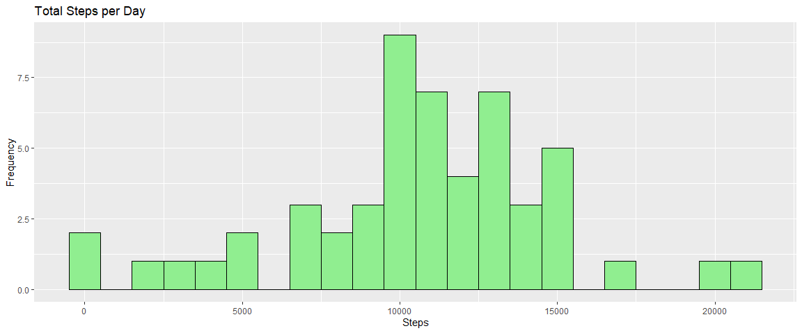
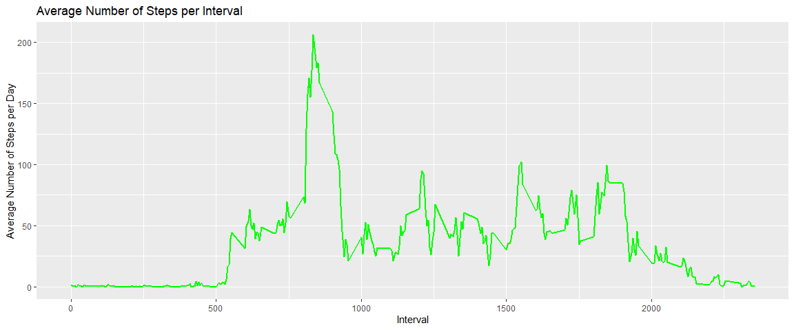
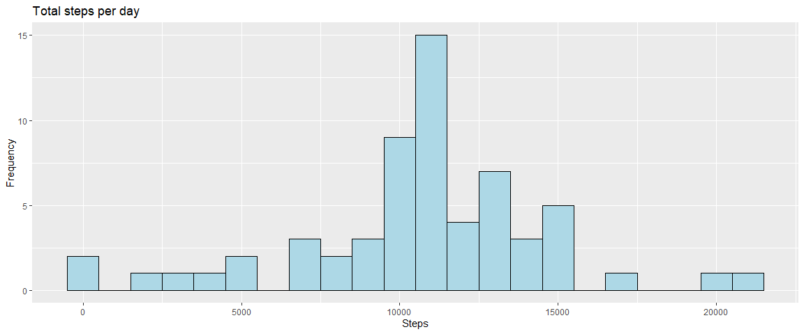
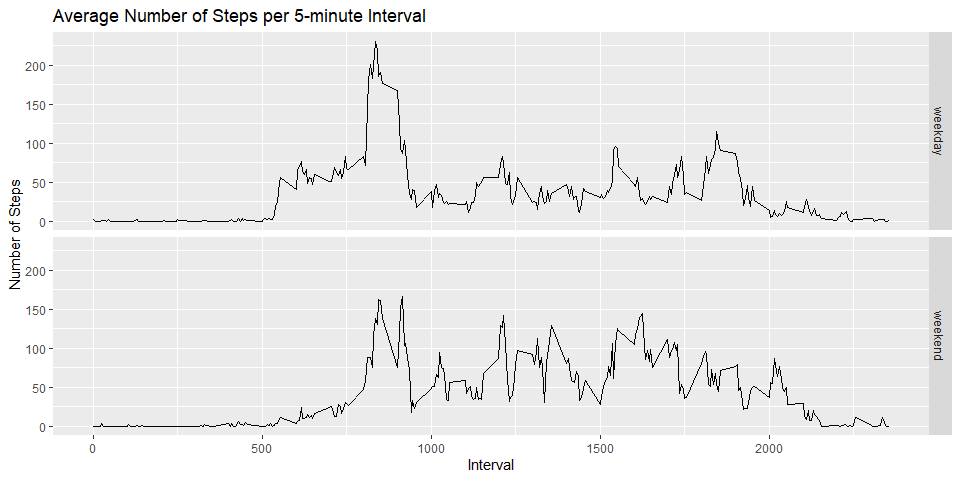

## Loading and processing the data

Unzip data to obtain a CSV file.


```r
unzip("repdata_data_activity.zip", exdir = "data")
```

## Reading csv data


```r
activity <- read.csv("data/activity.csv")
```

## What is the mean total number of steps taken per day?

1. Calculate the total number of steps taken per day.


```r
total_steps <- aggregate(steps ~ date, activity, sum, na.rm = FALSE)
```

2. Make a histogram of the total number of steps taken each day.


```r
library(ggplot2)
ggplot(total_steps, aes(x = steps)) + geom_histogram(fill = "light green", color = "black", binwidth = 1000) + labs(x = "Steps", y = "Frequency", title = "Total Steps per Day")
```

<!-- -->

3. Calculate and report the mean and median of the total number of steps taken per day.


```r
mean(total_steps$steps)
```

```
## [1] 10766.19
```

```r
median(total_steps$steps)
```

```
## [1] 10765
```

The average number of steps taken each day was 10766.19 steps.
The median number of steps taken each day was 10765 steps.

## What is the average daily activity pattern?

1. Make a time series plot(i.e. type = "l") of the 5-minute interval (x-axis) and the average number of steps taken, averaged across all days (y-axis).


```r
Interval <- aggregate(steps ~ interval, activity, mean, na.rm = TRUE)
ggplot(Interval, aes(x = interval, y = steps)) + geom_line(color = "green", size = 1) + labs(x = "Interval", y = "Average Number of Steps per Day", title = "Average Number of Steps per Interval")
```

<!-- -->

2. Which 5-minute interval, on average across all days in the dataset, contains the maximum number of steps?


```r
maximumSteps <- max(Interval$steps)
Interval[Interval$steps == maximumSteps, 1]
```

```
## [1] 835
```

The 5-minute interval which contained the maximum number of steps was 835th interval.

## Imputing missing values

1. Calculate and report the total number of missing values in the dataset.


```r
nrow(activity[is.na(activity$steps),])
```

```
## [1] 2304
```

The total number of missing values in the dataset is 2304.

2. Devise a strategy for filling in all of the missing values in the dataset.


```r
imp <- activity
for (i in 1:length(imp$steps)) {
        if (is.na(imp$steps[i])) {
                imp$steps[i] <- Interval$steps[Interval$interval == imp$interval[i]]
        }
} 
```

3. Create a new dataset that is equal to the original dataset but with the missing data filled in.


```r
imp_steps <- aggregate(steps ~ date, imp, sum, na.rm = TRUE)
```

4. Make a histogram of the total number of steps taken each day and calculate and report the mean and median total number of steps taken per day. 


```r
ggplot(imp_steps, aes(x = steps)) + geom_histogram(fill = "light blue", color = "black", binwidth = 1000) + labs(x = "Steps", y = "Frequency", title = "Total steps per day")
```

<!-- -->


```r
mean(imp_steps$steps)
```

```
## [1] 10766.19
```

```r
median(imp_steps$steps)
```

```
## [1] 10766.19
```

Type of Estimate | Mean | Median
--- | --- | --- 
Old (with NA) | 10766.19 | 10765
New (filling NA with mean) | 10766.19 | 10766.19

The new mean (10766.19) is the same as the old mean (10766.19), as a result of replacing all the missing values with the mean. The new median (10766.19) is slightly higher than the old median (10765). Replacing the missing values with the mean resulted in an increase of the median. The new and old histogram are fairly similar in shape. The mean and the median are now equal. 

## Are there differences in activty patterns between weekdays and weekends?

1. Create a new factor variable in the dataset with two levels - "weekday and "weekend" indicating whether a given date is a weekday or weekend day. 


```r
imp$date <- as.Date(imp$date)
imp$wkdy <- "weekday"
imp$wkdy[weekdays(imp$date) == "Saturday" | weekdays(imp$date) == "Sunday"] <- "weekend"
imp$wkdy <- as.factor(imp$wkdy)
```

2. Create a panel plot containing a time series plot (i.e. type = "l) of the 5-minute interval (x-axis) and the average number of steps taken, averaged across all weekday days (y-axis).


```r
imp_interval <- aggregate(steps ~ interval + wkdy, imp, mean, na.rm = TRUE)
ggplot(imp_interval, aes(x = interval, y = steps)) + facet_grid(wkdy ~ .) + geom_line() + labs(x = "Interval", y = "Number of Steps", title = "Average Number of Steps per 5-minute Interval") 
```

<!-- -->
